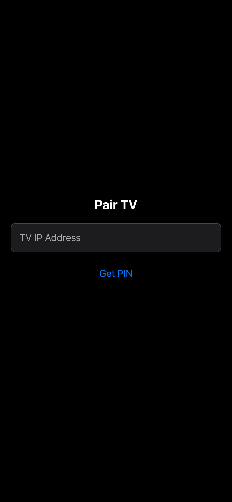
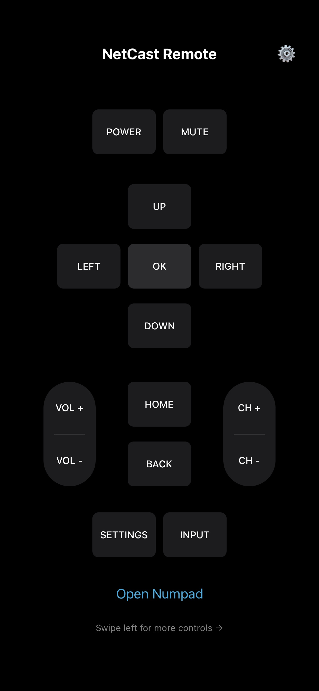
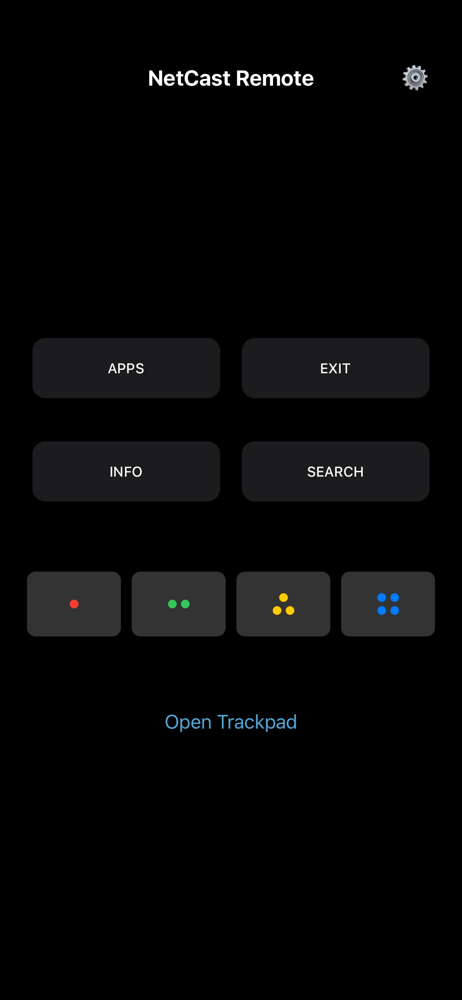
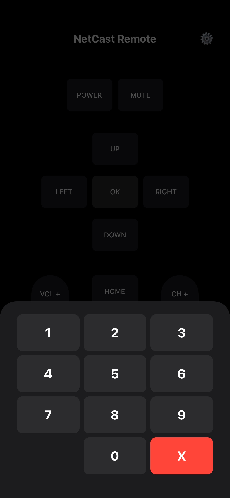
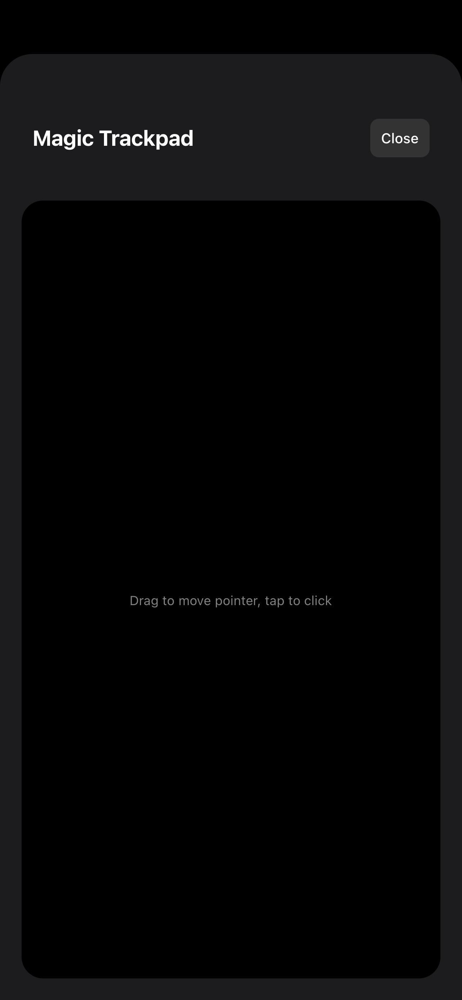
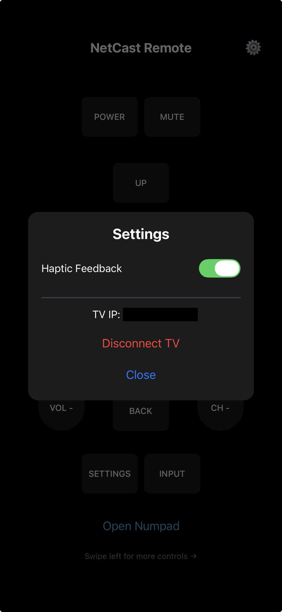

# 📺 NetCast
*A high-performance, cross-platform smart TV remote built with React Native.*

My physical LG TV waved its final goodbyes, so I engineered an ad-free, hardware-mimicking alternative. NetCast communicates directly with the TV over the local network using the ROAP (Remote Office Action Protocol) via XML payloads, providing a lightning-fast, zero-latency experience.

## 📸 Screenshots

<p align="center">
  
  
  
</p>
<p align="center">
  
  
  
</p>

## ✨ Features

* **Cross-Platform Control:** Fully functional on both iOS and Android.
* **Magic Trackpad Integration:** Uses custom gesture tracking (`PanResponder`) with throttled coordinate mapping to replicate the TV's native pointer functionality.
* **Hardware-Like UX:** Integrates tactile haptic feedback and authentic, accessibility-standard UI design (including geometric dot patterns for colorblind users).
* **Network Stability:** Implements custom input throttling to prevent packet loss or TV processor crashes during rapid button presses.
* **Zero-Config Sessions:** Securely caches the TV's IP, Session ID, and PIN via `AsyncStorage`, instantly executing silent handshakes when the app returns from the background.
* **Bulletproof Inputs:** Built-in IPv4 regex validation prevents malformed network requests before they execute.

## 🚀 Getting Started

### Android Installation
1. Go to [Releases](https://github.com/nihvp/NetCastApp/releases).
2. Download the latest `NetCastApp.apk`.
3. Install on your Android device (ensure "Install from unknown sources" is enabled).

### iOS Local Setup
Due to App Store restriction you will need to build locally. To run the project locally on an iPhone or the iOS Simulator, ensure your React Native environment (Node, Watchman, Ruby, Xcode) is configured.

```bash
# Clone the repository
git clone [https://github.com/nihvp/NetCastApp.git](https://github.com/nihvp/NetCastApp.git)
cd NetCastApp

# Install JavaScript dependencies
npm install

# Install Native iOS bridging files
cd ios
pod install
cd ..

# Launch the app
npx react-native run-ios
```

## 🛠️ Tech Stack & Architecture
* Framework: React Native

* Networking: Standard fetch API for raw XML HTTP POST requests (ROAP API)

* State Management & Caching: React Hooks (useState, useRef), @react-native-async-storage/async-storage

* Hardware APIs: react-native-haptic-feedback, PanResponder (Touch Gestures)

* CI/CD: Automated Android keystore management and GitHub Releases

##
Built with ❤️ (and a lot of Gradle troubleshooting).