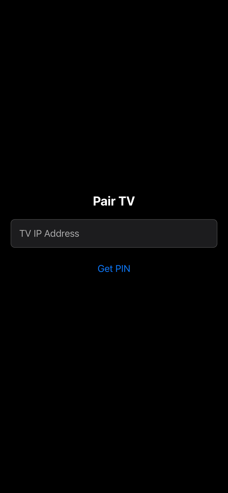
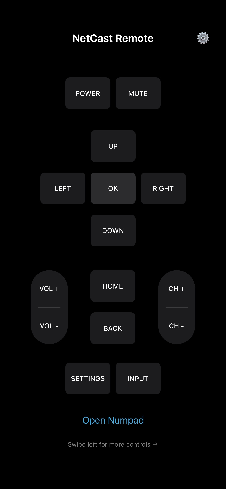
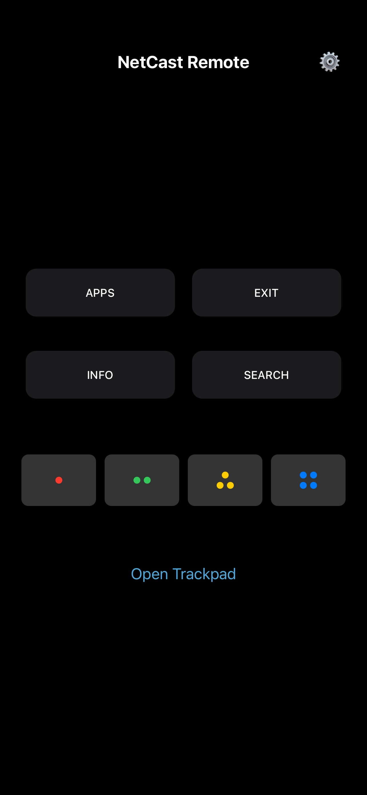
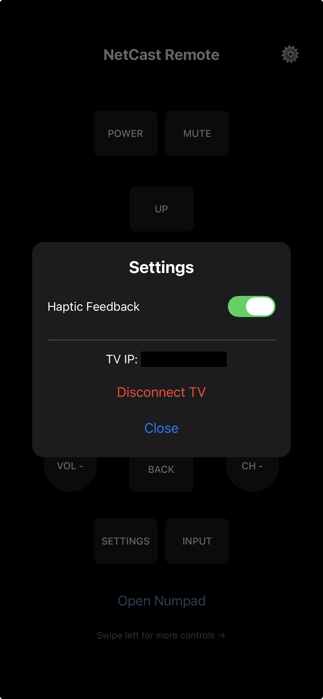
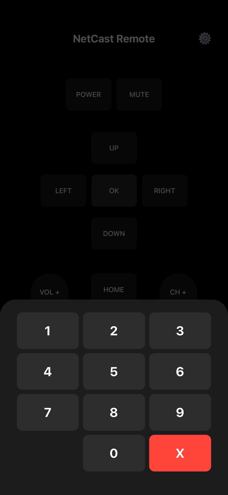
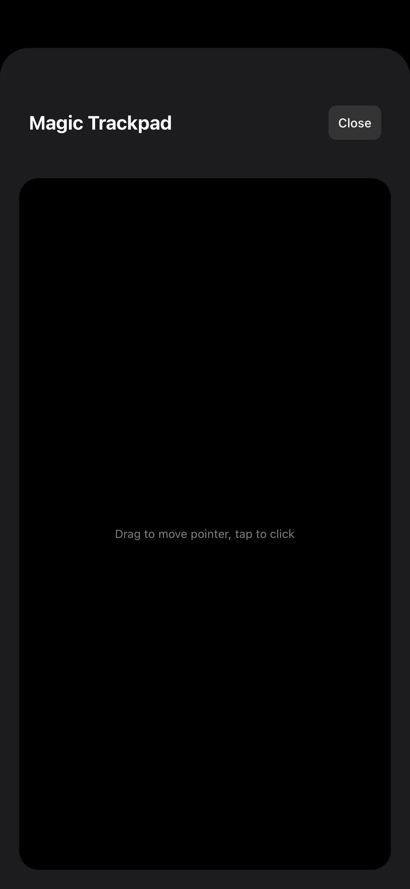

# 📺 NetCast
*A fast, ad-free, cross-platform smart TV remote.*

When my physical LG TV remote finally gave up the ghost, I refused to buy a replacement or download one of those spammy, ad-filled remote apps from the App Store. So, I built my own. 

NetCast talks directly to your TV over your local network (using the ROAP protocol)—meaning it's completely ad-free, respects your privacy, and has absolutely zero lag.

## Screenshots

<p align="center">
  
  
  
</p>
<p align="center">
  
  
  
</p>

## Features

* **Works Everywhere:** Runs beautifully on iOS, Android, and even in your web browser.
* **Magic Trackpad:** Swipe and tap just like the real thing to control the TV's pointer.
* **Feels Real:** Every button press gives a satisfying haptic vibration. We even included accessibility features like geometric dot patterns for colorblind users.
* **Smart Reconnect:** Pair it once and you're done. The app silently reconnects to your TV in the background every time you open it.
* **No Spam, No Lag:** By talking directly to your TV's IP address, button presses are instant and your data never leaves your house.

## Getting Started

### Android
1. Go to [Releases](https://github.com/nihvp/NetCastApp/releases).
2. Download the latest `NetCastApp.apk`.
3. Install it directly on your phone (you might need to allow "Install from unknown sources").

### Web App (Self-Hosted)
Don't want to install a mobile app? You can run NetCast right from any web browser by spinning up the lightweight Node.js proxy server.

```bash
# Navigate to the webapp directory
cd webapp

# Install dependencies
npm install

# Start the proxy server
npm start
```
Now just open `http://localhost:3000` (or your computer's local IP address) on any phone, tablet, or PC on your network!

### iOS (Local Build)
Apple's App Store rules mean you'll need to build the app yourself to run it on an iPhone. If you have a Mac and React Native set up:

```bash
git clone https://github.com/nihvp/NetCastApp.git
cd NetCastApp
npm install

cd ios
pod install
cd ..

npx react-native run-ios
```

## Tech Stuff
* **Mobile App:** Built with React Native
* **Web App:** Built with plain HTML/JS and an Express (Node.js) proxy
* **Networking:** Standard fetch API sending raw XML HTTP POST requests (ROAP API)
* **Storage:** `@react-native-async-storage/async-storage` for remembering your pairing sessions securely.

---
Built with ❤️ to solve a problem, not sell your data.

*Disclaimer: This application is an independent third-party tool and is NOT affiliated with, endorsed by, or associated with LG Electronics Inc. "LG" and "NetCast" are registered trademarks of LG Electronics Inc.*
